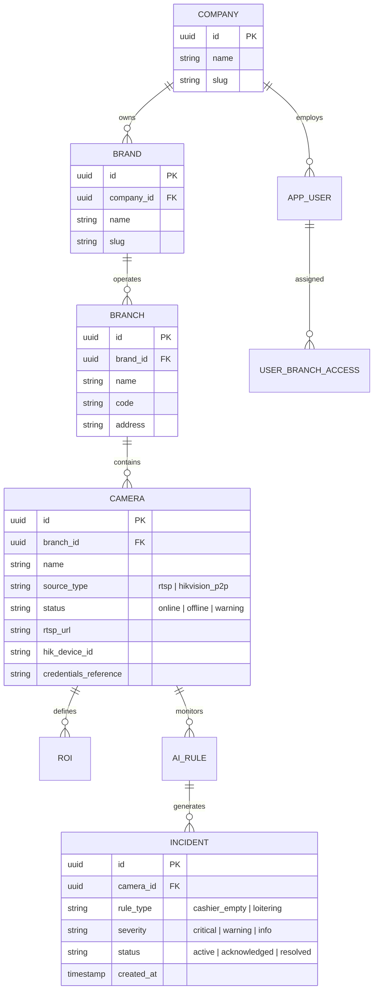
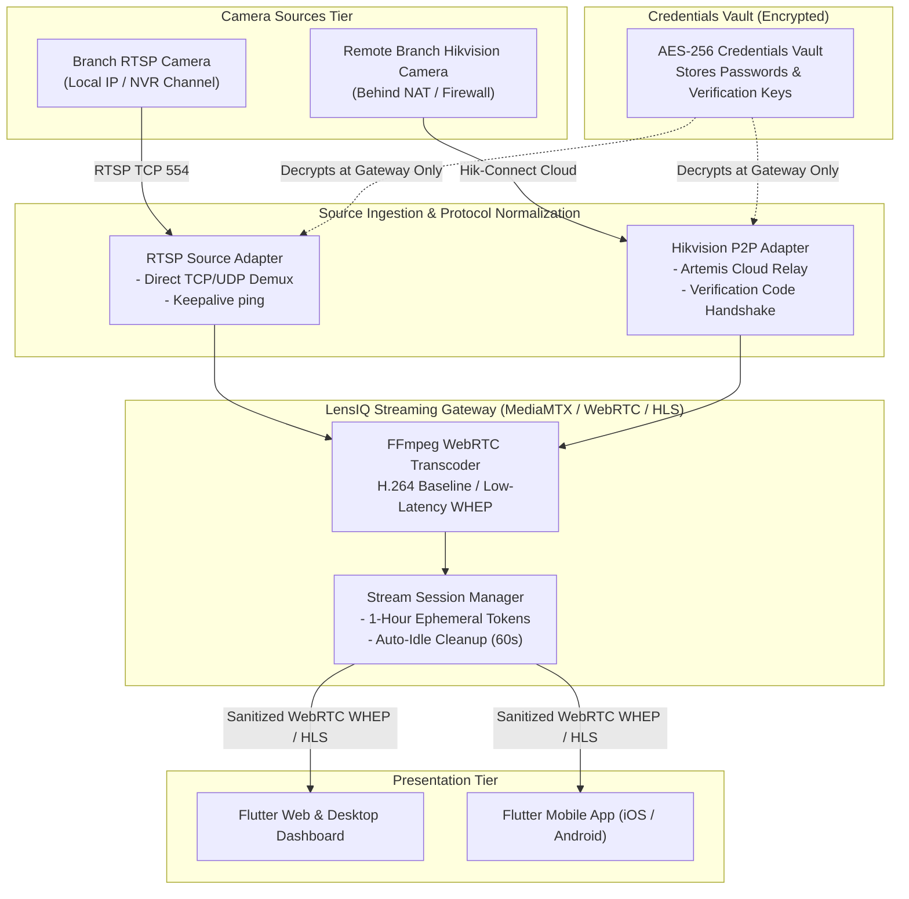
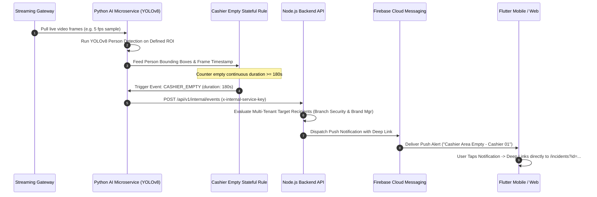

# LensIQ Enterprise Platform Architecture

## 1. System Overview

LensIQ is an enterprise-grade, multi-tenant AI CCTV monitoring and analytics platform. It unifies video ingestion from diverse IP camera sources (traditional RTSP and Hikvision P2P Cloud Relay), processes live video feeds with YOLOv8 computer vision models, detects operational violations (such as unattended cashiers), and broadcasts instantaneous push notifications to targeted enterprise staff.

---

## 2. Multi-Tenant Data Hierarchy

---

## 3. Dual Video Source Ingestion Pipeline

---

## 4. AI Event Detection & Incident Lifecycle Pipeline

---

## 5. Client Localization & Arabization Engine

LensIQ provides seamless, zero-restart language switching:
* **Default Language**: English (`en`) with Left-to-Right (`TextDirection.ltr`) layout.
* **Secondary Language**: Arabic (`ar`) with Right-to-Left (`TextDirection.rtl`) layout.
* **Persistent Selection**: Persisted via `SharedPreferences` across browser reloads and app restarts.
* **Granular UI Coverage**: Sidebar, top app bars, status badges, camera filters, notification panel, and settings cards.
